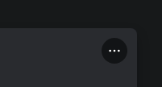

# Memberlist Hover
Collapses the member list with a minimalistic style and expands it on hover
```css
@import url('https://raw.githubusercontent.com/lithwack/Vencord-Repos/refs/heads/main/Memberlist%20Hover');
```
---

 

### <ins>**These variables are necessary for the snippet to function**</ins>
```css
:root {
    --hover-animation-speed: 0.3s;
    --nametag-fade-speed: .5s ease-in;
    --icon-custom-color: var(--channels-default);
}
```

---
Supports the activity cards and the [MemberCount plugin](https://vencord.dev/plugins/MemberCount)
<p align="center">
    
    
</p>

---
# Smaller Snippets
### Message Actions Hover
Hides all but one message action buttons and reveals them all on hover
```css
@import url('https://raw.githubusercontent.com/lithwack/Vencord-Repos/refs/heads/main/Message%20Actions%20Hover');
```
<p align="left">
  
</p>

---
### Chat Button Hover
Hides all but one chat buttons and reveals them all on hover
```css
@import url('https://raw.githubusercontent.com/lithwack/Vencord-Repos/refs/heads/main/Action%20Button%20Hover');
```
<p align="left">
  
</p>

---
### Collapsed Search Bar 
Collapses the search bar and expands it after clicking on it
```css
@import url('https://raw.githubusercontent.com/lithwack/Vencord-Repos/refs/heads/main/Collapsed%20Search%20Bar');
```
<p aligh="left">
  
</p>

---
### Profile Popout Actions Hover
Hides all but one profile action buttons and reveals them all on hover
```css
@import url('https://raw.githubusercontent.com/lithwack/Vencord-Repos/refs/heads/main/Profile%20Popout%20Actions%20Hover');
```
<p aligh="left">
  
</p>

---
### Server Tag Hover 
Hides the name of the tag and reveals it on hover
```css
@import url('https://raw.githubusercontent.com/lithwack/Vencord-Repos/refs/heads/main/Server%20Tag%20Hover');
```
---
 

### <ins>**These variables are necessary for the snippet to function**</ins>
```css
:root {
    --expand-speed: 0.3s ease;
    --expand-delay: 0.2s;
    --collapse-delay: 0s;
}
```

---
