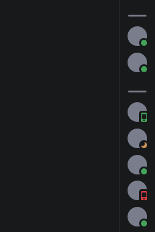

# Memberlist Hover
### Collapses the member list with a minimalistic style and expands it on hover.
```css
@import url('https://raw.githubusercontent.com/lithwack/Vencord-Repos/refs/heads/main/Memberlist%20Hover');
```
---

 

### These variables are necessary for the snippet to function
```css
:root {
    --hover-animation-speed: 0.3s;
    --nametag-fade-speed: .5s ease-in;
    --icon-custom-color: var(--channels-default);
}
```

---
Supports the activity cards and the [MemberCount plugin](https://vencord.dev/plugins/MemberCount)
<p>
    
    
</p>

---
